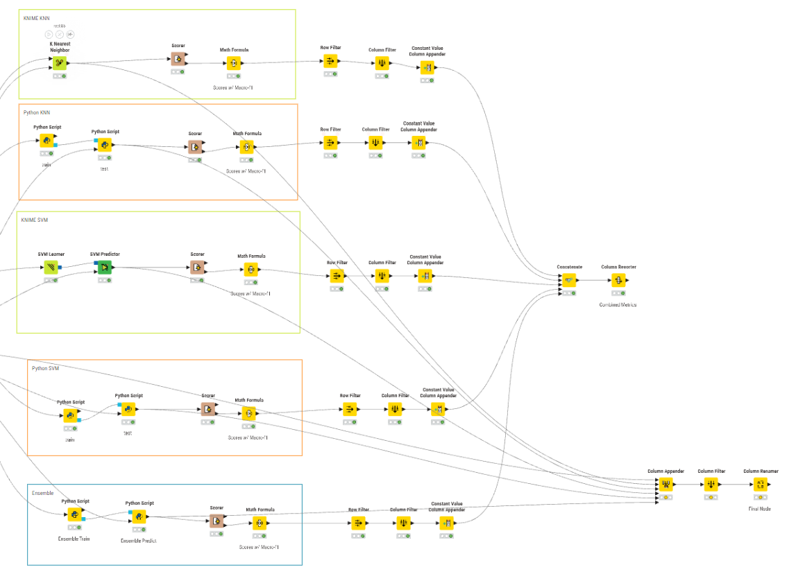

# Customer Churn Classifier

> *A multi-model supervised classification workflow predicting telecom customer churn, built in KNIME and in Python*

## Overview

- An end-to-end classification pipeline that goes from EDA through preprocessing and tuning to a soft-voting ensemble
- KNN and SVM are each built twice, once with native KNIME learner nodes and once in Python, and all five models are compared on the same test set
- The data is imbalanced (always guessing "No" already scores 73% accuracy), so models are ranked by macro-F1 and Cohen's kappa rather than raw accuracy
- **EDA-driven feature selection.** Ranked categorical features by the standard deviation of churn rate across their classes, and compared numeric distributions with churn-conditional box plots. Features with little separation (e.g. Gender) were dropped.
- **Removed redundant categories.** Found that six service features share an identical "No Internet Service" class that duplicates the Internet Service feature, and merged it into "No".
- **Justified preprocessing.** Stratified train/test split, imputed 0 for the missing Total Charges values (all new customers with tenure = 0), z-score normalization, and one-hot encoding with the redundant `No_*` columns dropped.
- **Tuned KNN and SVM on both platforms.** Raising k from 3 to 17 lifted kappa from 0.34 to about 0.46. The SVM uses an RBF kernel with low C, and Python's gamma was converted to KNIME's sigma parameter.
- **Soft-voting ensemble** of the tuned KNN and SVM plus Random Forest. It scored the best macro-F1 (0.737) and kappa (0.475) of all five models.

## Tech Stack

| Layer | Tools | Description |
|---|---|---|
| **EDA** | KNIME (GroupBy, Pivot, Box Plot, Pie Chart) | Churn-rate aggregation per class and distribution comparisons |
| **Preprocessing** | KNIME (Partitioning, Missing Value, Normalizer, One to Many) | Stratified split, imputation, z-scoring, one-hot encoding |
| **Modeling** | KNIME Learner nodes, Python (Scikit-learn) | KNN, SVM, Random Forest, soft-voting ensemble |
| **Evaluation** | KNIME Scorer, Python | Macro-F1, Cohen's kappa, accuracy, and per-class recall/precision |

## Skills Developed

- Choosing evaluation metrics for imbalanced classification
- Hyperparameter tuning (k, C, kernel, gamma/sigma)
- Ensemble design with soft voting
- Building visual (low-code) and code-based ML pipelines side by side
