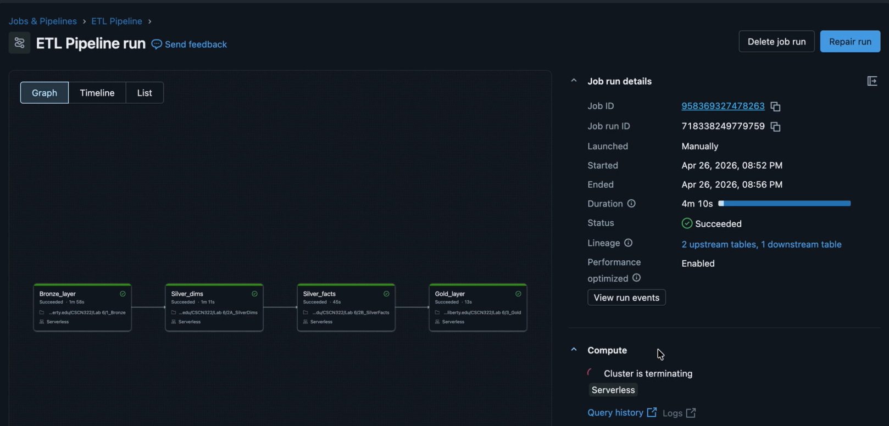

# Healthcare Data Warehouse

> *A dimensional data warehouse built from synthetic patient records, loaded through an SSIS ETL pipeline and analyzed as a Databricks Lakehouse*

## Overview

- Raw Synthea-format healthcare CSVs are staged, modeled into a Kimball star schema with SSIS, then exported into a Databricks Lakehouse for demographic and clinical analysis
- **Modeled a Kimball-style star schema** from a Bus Matrix requirements worksheet — 11 dimension tables (patient, condition, medication, procedure, etc.) and 9 fact tables (encounters, claims, immunizations, etc.) covering the full clinical and billing picture
- **Enforced dimensional integrity** with surrogate keys, ETL audit columns (`etl_process_id`, `etl_process_date`), and default "Unknown member" rows so fact records with missing or late-arriving dimension keys never silently drop out of the warehouse
- **Orchestrated the Lakehouse load as a Databricks job.** Four serverless notebook tasks run in order (Bronze → Silver dims → Silver facts → Gold), end to end in about 4 minutes
- **Ran cross-table analysis in a Databricks Lakehouse** using PySpark joins between fact and dimension tables — e.g. allergy prevalence broken down by patient ethnicity

## Tech Stack

| Layer | Tools | Description |
|---|---|---|
| **Ingestion** | SSIS (`ImportLoad.dtsx`) | Loads raw Synthea-format CSVs (patients, encounters, conditions, medications, claims, and more) into staging tables |
| **Modeling** | SSIS (`DimLoad.dtsx` / `FactLoad.dtsx`), SQL Server | Builds the star schema — surrogate-keyed dimensions and facts with audit columns and default "Unknown member" rows |
| **Analysis** | Databricks, PySpark | Loads the warehouse into a Lakehouse through a medallion (Bronze → Silver → Gold) job, then runs joins/aggregations for demographic and clinical insights |

## Skills Developed

- Dimensional modeling (Kimball star schema, bus matrix planning)
- ETL pipeline design with SQL Server Integration Services
- Lakehouse analytics with PySpark
