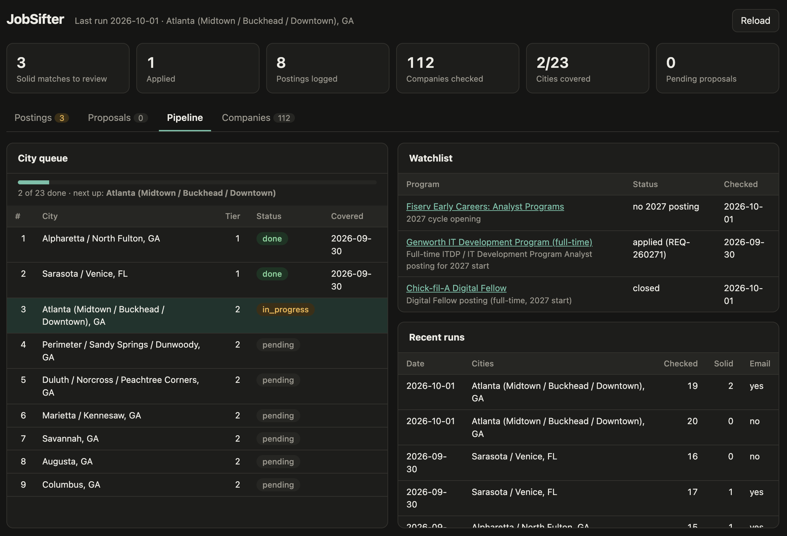

# JobSifter

> *A scheduled AI agent that finds, filters and scores entry-level job postings from company career pages, then emails only the strong matches*

## Overview

- **A scheduled AI agent that runs once a day, unattended.** It works through a ranked queue of cities, finds local companies through chamber of commerce directories, business journals and regional tech associations, and checks their career pages directly instead of the big job boards. Every posting has to pass hard filters, then gets scored on five weighted axes. It sends an email only when a posting clears the threshold
- **Built like a data pipeline, not a chatbot.** The rules live in a written spec, and all state lives in CSV files, so nothing carries over between runs except the data. The agent pulls structured postings from ATS JSON APIs (Greenhouse, Lever, Ashby, Workday) and uses a browser only as a fallback. Postings are deduplicated on requisition IDs, and recheck and discovery have separate budgets so the growing company list never crowds out discovery. After each run it commits a snapshot of the data to git with a log of its judgment calls
- **Human-gated feedback loop.** Manual feedback is written as countable tags (`role:too-senior`, `+industry`). Once a week, a review run proposes at most three rule changes, each backed by at least three postings. Nothing changes until a proposal is approved by hand, so one odd decision can't snowball into a permanent filter

## Tech Stack

| Layer | Tools | Description |
|---|---|---|
| **Agent** | Claude Code (scheduled task), Markdown spec | Executes the daily run and weekly review against a written rulebook |
| **Collection** | ATS JSON APIs (Greenhouse, Lever, Ashby, Workday), headless browser | Pulls structured posting data, with browser fallback for JS-rendered career pages |
| **Storage** | CSV, Python `csv`, Git | Flat-file state for postings, companies, cities, runs, watchlist and proposals, snapshotted after every run |
| **Enrichment** | Python (`urllib`, regex) | Cross-references postings against public new-grad lists |
| **Notification** | Python (`smtplib`), macOS Keychain | Builds and sends the match email without exposing credentials to the agent |
| **Dashboard** | Python `http.server`, HTML/JavaScript | Local UI and JSON API for manual triage and proposal approval |

## Skills Developed

- AI agent design: specs, guardrails and stateless orchestration for autonomous LLM agents
- Stateless pipeline design with flat-file state and idempotent writes
- Working with public ATS APIs and JavaScript-rendered pages
- Rule-based scoring and record deduplication
- Human-in-the-loop feedback systems that resist drift
